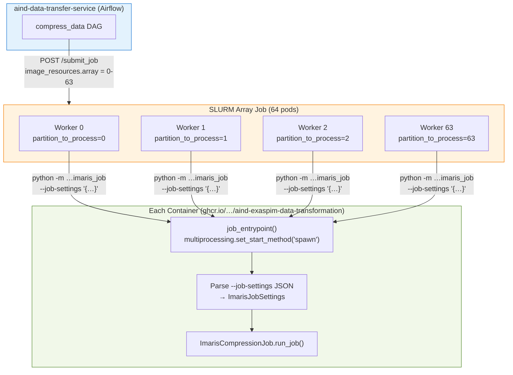
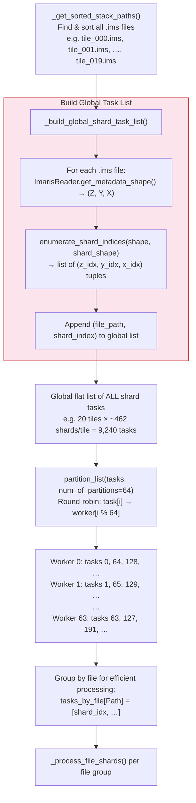
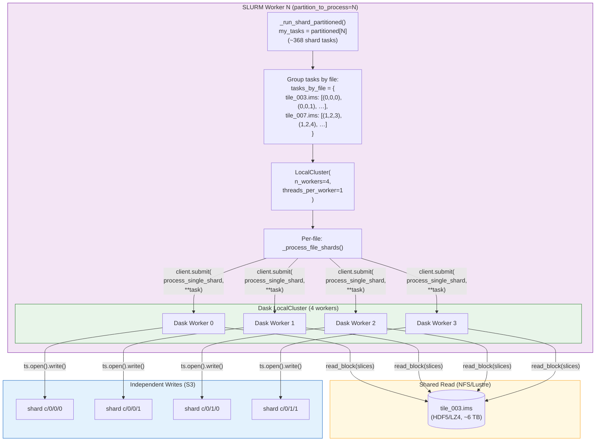
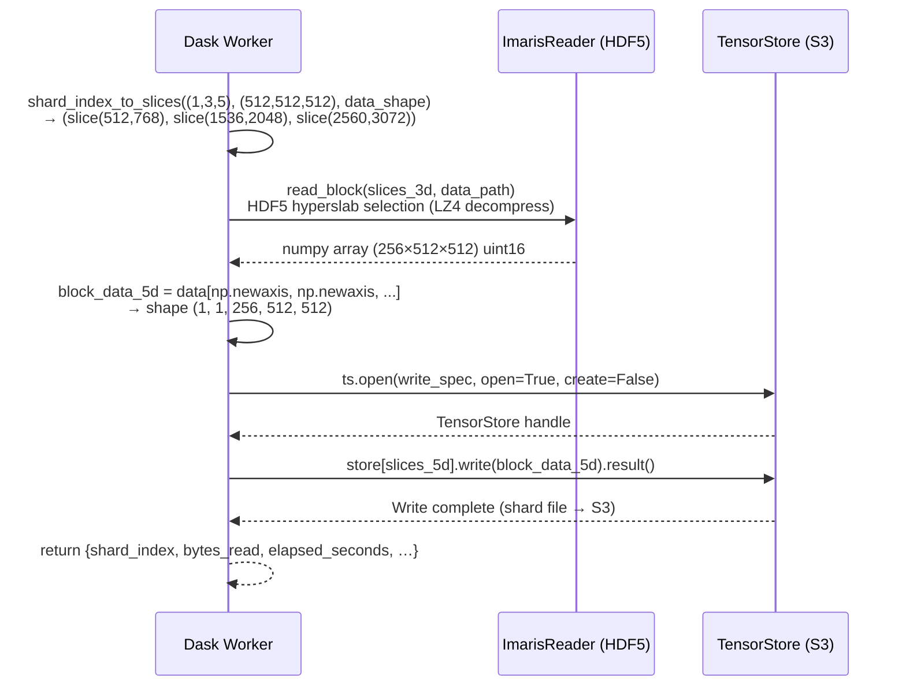
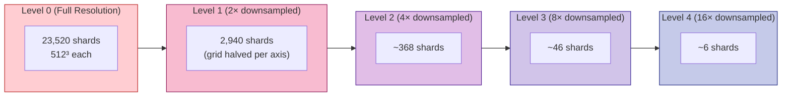
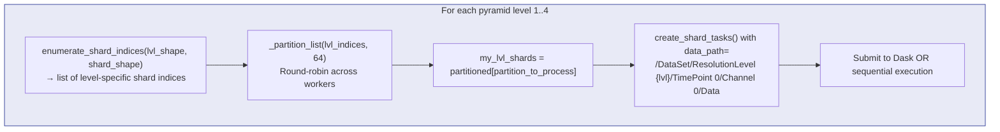
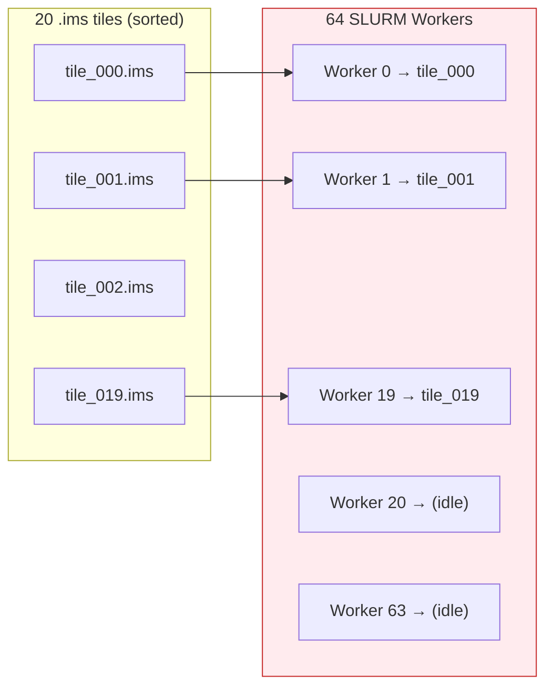
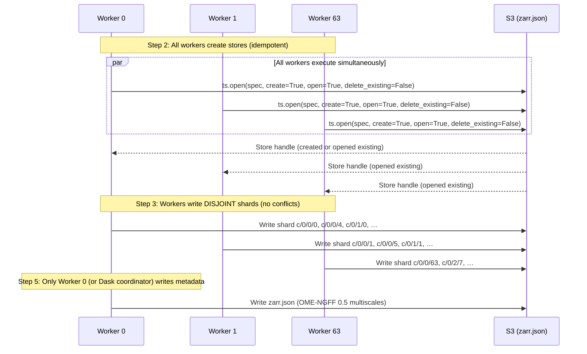

# Worker Partitioning & Shard Distribution

## Overview

The ExaSPIM data transformation pipeline uses **shard-level partitioning** (default) to distribute work across up to 64 SLURM array workers. Each worker independently reads from shared Imaris `.ims` files and writes to disjoint shard files in the output Zarr v3 store — **no inter-worker coordination** is required during data processing.

---

## Orchestration: Airflow → SLURM Array → Workers

---

## Shard-Level Partitioning Strategy

The **default** `partition_mode="shard"` distributes work at sub-file granularity. This is critical because a single tile can be 6 TB — with only 2–20 tiles, file-level distribution would leave most workers idle.

### Distribution Math (Typical Dataset)

| Parameter | Value |
|-----------|-------|
| Tiles | 20 × `.ims` files |
| Tile shape | `~768 × 10752 × 14336` voxels |
| Shard shape | `512 × 512 × 512` |
| Shards per tile | `⌈768/512⌉ × ⌈10752/512⌉ × ⌈14336/512⌉ = 2 × 21 × 28 = 1,176` |
| **Total shards (base level)** | **20 × 1,176 = 23,520** |
| Workers | 64 |
| **Shards per worker** | **~368** (round-robin balanced) |
| Dask workers per container | 4 |
| **Effective parallelism** | **64 × 4 = 256 concurrent shard writes** |

---

## Worker Internal Architecture: Dask LocalCluster

Each SLURM worker creates a **local Dask cluster** to further parallelize shard processing within its container:

---

## `process_single_shard()` — The Atomic Work Unit

Each Dask worker executes this function for ONE shard at a time. It is fully self-contained:

**Key properties:**
- No lock contention — each shard maps to a unique S3 object
- Memory per worker = 1 shard: `512³ × 2 bytes = 256 MB`
- HDF5 concurrent read is safe (read-only access)
- Each shard is written as one atomic S3 PutObject

---

## Pyramid Level Distribution

After base-level (level 0) shards are written, **pyramid levels 1–4** are independently re-partitioned across the same 64 workers. Each level has fewer shards (halved per axis → 1/8th):

> **Note:** Pyramid shards are partitioned **independently** from base shards. Worker 5's level-2 shards need not correspond spatially to its level-0 shards. This maximizes load balance since higher levels have far fewer shards.

---

## File-Level Mode (Legacy, `partition_mode="file"`)

For comparison, the legacy mode distributes **entire files** round-robin:

**Problem:** With 20 tiles and 64 workers, **44 workers sit idle**. Shard-level mode eliminates this waste completely.

---

## Idempotent Store Creation (Race-Free)

All workers idempotently create/open Zarr stores before submitting shard tasks:

---

## Key Code References

| Component | File | Line |
|-----------|------|------|
| `partition_list()` round-robin | `imaris_job.py` | L44 |
| `_build_global_shard_task_list()` | `imaris_job.py` | L683 |
| `_run_shard_partitioned()` | `imaris_job.py` | L723 |
| `_process_file_shards()` | `imaris_job.py` | L790 |
| `enumerate_shard_indices()` | `compress/imaris_to_zarr.py` | L366 |
| `process_single_shard()` | `compress/imaris_to_zarr.py` | L383 |
| `create_shard_tasks()` | `compress/imaris_to_zarr.py` | L466 |
| Pyramid level re-partition | `compress/imaris_to_zarr.py` | L1900 |
| Worker 0 metadata duties | `imaris_job.py` | L865–L870 |
