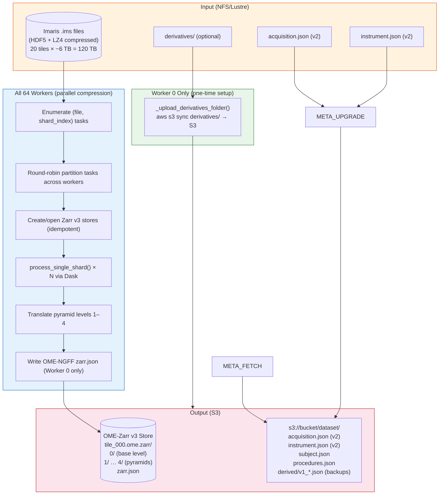
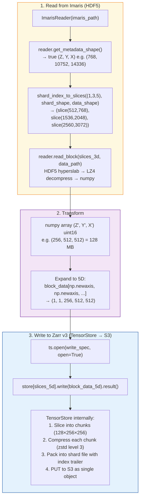
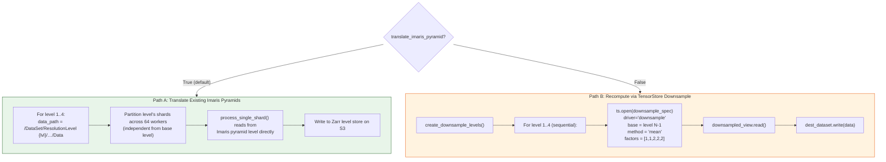
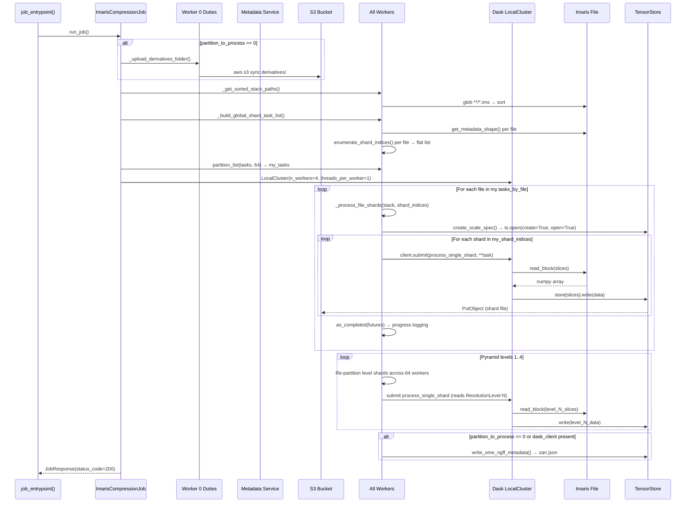
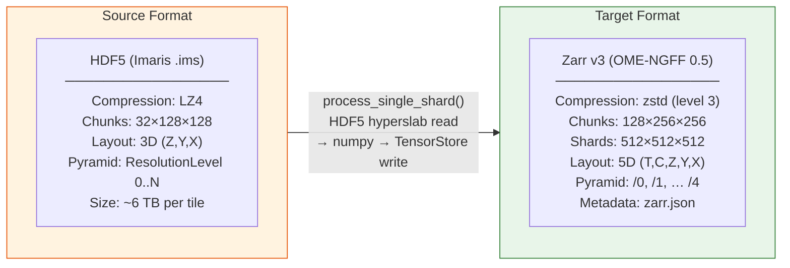

# End-to-End Data Flow Pipeline

## Overview

This diagram traces data from raw Imaris `.ims` files through compression and pyramid generation to the final OME-Zarr v3 store on S3. The pipeline is split across two responsibility domains: **Worker 0** handles one-time metadata tasks, and **all workers** (including Worker 0) handle compression.

---

## High-Level Pipeline (Swim-Lane)



---

## Detailed Data Flow Per Shard (Base Level)



---

## Pyramid Level Generation (Two Paths)



**Path A** is preferred: reads pre-computed pyramids from the `.ims` file (already generated by microscope acquisition software), distributed across workers. **Path B** is a fallback that uses TensorStore's streaming downsample driver — sequential but memory-efficient.

---

## `run_job()` Complete Sequence



---

## Data Format Transitions



---

## S3 Output Structure

```
s3://aind-open-data/exaSPIM_765830_2026-01-15_12-00-00/
├── acquisition.json          (v2, from rig)
├── instrument.json           (v2, from rig)
├── subject.json              (from gather_preliminary_metadata)
├── procedures.json           (from gather_preliminary_metadata)
└── SPIM/
    ├── tile_000_ch_488.ome.zarr/
    │   ├── zarr.json         (OME-NGFF 0.5 multiscales metadata)
    │   ├── 0/                (base resolution)
    │   │   ├── zarr.json     (array metadata: shape, codecs, sharding)
    │   │   └── c/0/0/0       (shard files, each ~256MB compressed)
    │   │       c/0/0/1
    │   │       …
    │   ├── 1/                (2× downsampled)
    │   ├── 2/                (4× downsampled)
    │   ├── 3/                (8× downsampled)
    │   └── 4/                (16× downsampled)
    ├── tile_001_ch_488.ome.zarr/
    │   └── …
    └── derivatives/          (synced from source)
```

---

## Key Code References

| Step | Function | File | Purpose |
|------|----------|------|---------|
| Entry | `job_entrypoint()` | `imaris_job.py:L905` | CLI parse, multiprocessing spawn |
| Orchestrate | `run_job()` | `imaris_job.py:L855` | Main dispatch |
| File discovery | `_get_sorted_stack_paths()` | `imaris_job.py:L96` | Glob + sort .ims |
| Task enumeration | `_build_global_shard_task_list()` | `imaris_job.py:L683` | All (file, shard) tuples |
| Per-file processing | `_process_file_shards()` | `imaris_job.py:L790` | Dask submission |
| Shard read/write | `process_single_shard()` | `compress/imaris_to_zarr.py:L383` | Atomic shard unit |
| TensorStore spec | `create_scale_spec()` | `compress/imaris_to_zarr.py:L134` | Zarr v3 + sharding codec |
| Pyramid translate | `imaris_to_zarr_distributed()` Step 4 | `compress/imaris_to_zarr.py:L1880` | Level re-partition |
| OME metadata | `write_ome_ngff_metadata()` | `compress/omezarr_metadata.py` | NGFF 0.5 multiscales |
