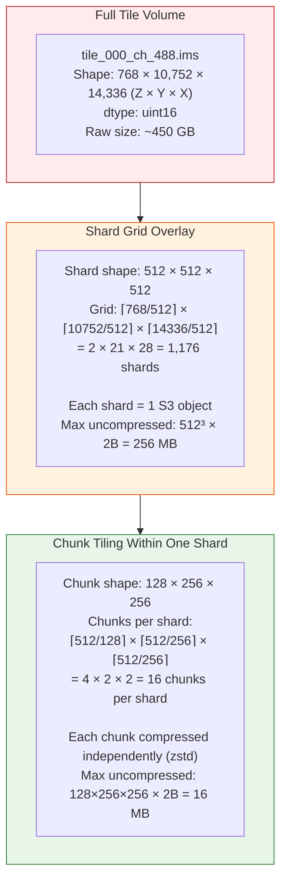
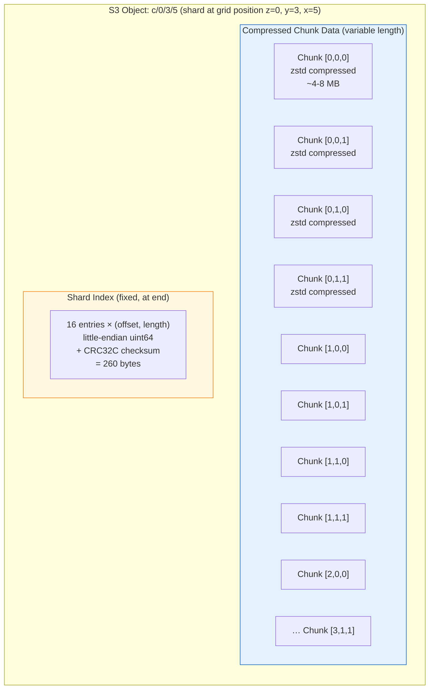
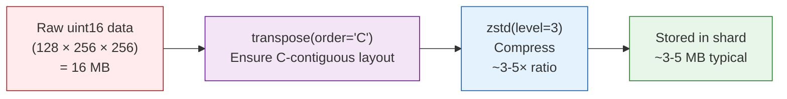
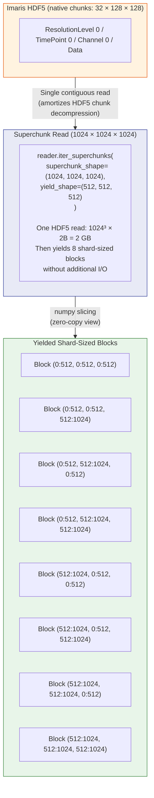
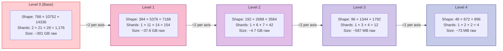
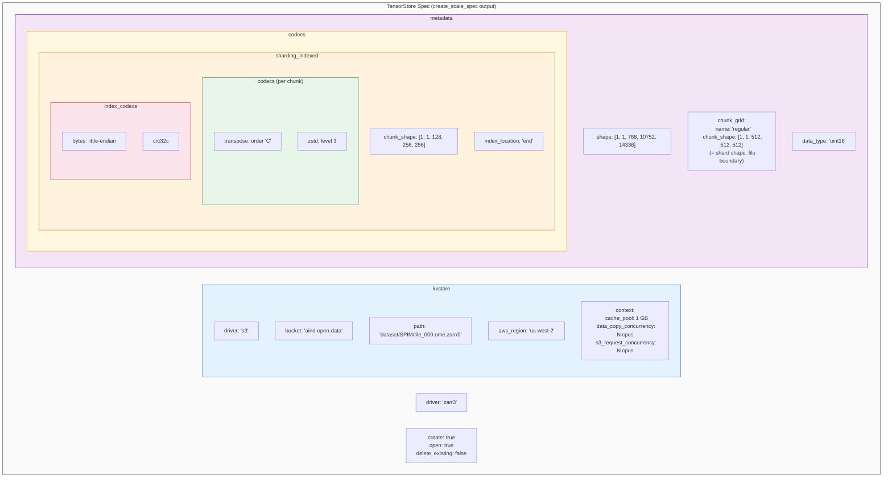
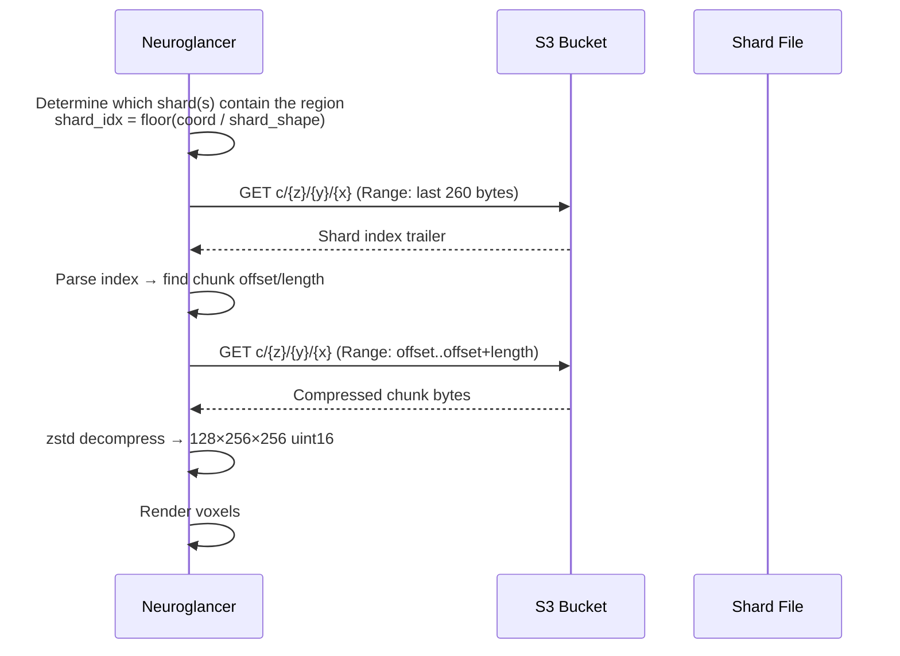

# Chunk, Shard & Superchunk Nesting

## Overview

The Zarr v3 output uses a **three-level nesting** for efficient parallel writes and reads. Understanding this hierarchy is critical for tuning performance and reasoning about I/O patterns.

```
Tile Volume (full image)
  └── Shard (file granularity — each shard = 1 S3 object)
        └── Chunk (compression unit — smallest addressable read)
```

On the **read side**, a fourth concept — the **Superchunk** — amortizes HDF5 I/O by reading a large contiguous region and slicing it into shard-sized blocks without additional disk access.

---

## Spatial Hierarchy Diagram



---

## Physical Layout of a Single Shard File

Each shard on S3 is a self-contained binary file with the following structure:



### Codec Chain (per chunk):



---

## Byte-Size Math

### Per Chunk (compression unit)

| Metric | Value |
|--------|-------|
| Chunk shape | 128 × 256 × 256 |
| Voxels per chunk | 8,388,608 |
| dtype | uint16 (2 bytes) |
| **Uncompressed size** | **16 MB** |
| Typical zstd ratio | 3–5× for microscopy data |
| **Compressed size** | **~3–5 MB** |

### Per Shard (file granularity)

| Metric | Value |
|--------|-------|
| Shard shape | 512 × 512 × 512 |
| Voxels per shard | 134,217,728 |
| Chunks per shard | 4 × 2 × 2 = 16 |
| **Uncompressed size** | **256 MB** |
| **Compressed size** | **~50–85 MB** |
| S3 PutObject | Single request per shard |

### Per Tile (full image)

| Metric | Value |
|--------|-------|
| Tile shape | 768 × 10,752 × 14,336 |
| Total voxels | ~118 billion |
| Shards per tile | 2 × 21 × 28 = 1,176 |
| **Uncompressed size** | **~301 GB** (base level only) |
| **Compressed size** | **~60–100 GB** |

### Per Dataset (all tiles + pyramids)

| Metric | Value |
|--------|-------|
| Tiles | 20 |
| Total base-level shards | 20 × 1,176 = 23,520 |
| Pyramid overhead | ~14% (geometric series 1/8 + 1/64 + …) |
| **Estimated output size** | **~1.3–2.3 TB** compressed |

---

## Superchunk Read Pattern (I/O Optimization)

The **superchunk** is a read-side concept in `imaris_to_zarr_parallel()` that amortizes HDF5 I/O latency by reading a large contiguous region, then slicing it into shard-sized blocks:



### Superchunk vs Direct Shard Read

| Approach | I/O Operations | Memory | Use Case |
|----------|---------------|--------|----------|
| **Direct shard read** (`process_single_shard`) | 1 HDF5 read per shard | 256 MB | Distributed mode (default) |
| **Superchunk batch** (`iter_superchunks`) | 1 HDF5 read per 8 shards | 2 GB | Single-process parallel mode |

In **distributed mode** (shard-per-worker), direct shard reads are used because each worker only processes its own shards — the superchunk optimization only helps the single-process `imaris_to_zarr_parallel()` writer.

---

## Pyramid Level Scaling

Each pyramid level halves each spatial dimension, reducing the shard grid by 8× per level:



### Shard Clamping at Small Levels

When a pyramid level's dimension is smaller than the shard shape, `create_scale_spec()` clamps shards:

```python
# From create_scale_spec() line ~200
clamped_shard = []
for s, c, d in zip(shard_shape, clamped_chunk, data_shape):
    clamped = min(s, d)                    # Don't exceed data dimension
    clamped = (clamped // c) * c           # Round to chunk multiple
    if clamped < c: clamped = c            # At least one chunk
    clamped_shard.append(clamped)
```

This ensures **shard shape is always a multiple of chunk shape** (Zarr v3 sharding requirement), even for small pyramid levels.

---

## TensorStore Zarr v3 Spec Structure

The spec built by `create_scale_spec()` defines the complete storage schema:



### Important Zarr v3 Semantics

| Zarr v3 Concept | Mapped To | Meaning |
|-----------------|-----------|---------|
| `chunk_grid.chunk_shape` | Shard shape `[1,1,512,512,512]` | Defines the **file boundary** — each grid cell = 1 stored file/object |
| `sharding_indexed.chunk_shape` | Inner chunk `[1,1,128,256,256]` | The **compression unit** within each shard |
| `codecs` (outer) | `sharding_indexed` only | The shard codec wraps everything |
| `codecs` (inner) | `transpose` + `zstd` | Applied per inner chunk |

> **Critical distinction:** In Zarr v3 with sharding, the "chunk" in `chunk_grid` is actually the **shard** (storage boundary), while the "chunk" inside `sharding_indexed` is the true compression chunk. TensorStore's API reflects this.

---

## Read Path (Client Perspective)

When a viewer (e.g., Neuroglancer) reads a region:



The **shard index at the end** enables random-access reads of individual chunks within a shard using HTTP Range requests — only the needed chunk is fetched and decompressed.

---

## Key Code References

| Component | File | Line |
|-----------|------|------|
| `create_scale_spec()` | `compress/imaris_to_zarr.py` | L134 |
| `_build_kvstore_spec()` | `compress/imaris_to_zarr.py` | L92 |
| `enumerate_shard_indices()` | `compress/imaris_to_zarr.py` | L366 |
| `compute_shard_grid()` | `compress/imaris_to_zarr.py` | L283 |
| `shard_index_to_slices()` | `compress/imaris_to_zarr.py` | L310 |
| `iter_superchunks()` | `utils/io_utils.py` | ImarisReader method |
| `iter_block_aligned_slices()` | `compress/imaris_to_zarr.py` | L1130 |
| Shard clamping logic | `compress/imaris_to_zarr.py` | L195–210 |
| Chunk/shard defaults | `models.py` | L63–72 |
