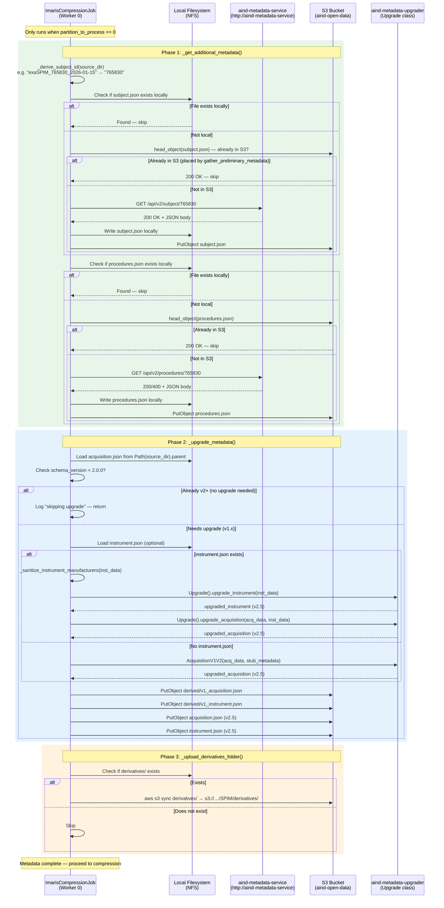
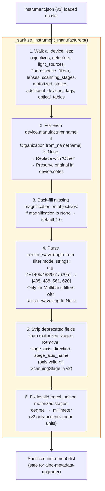
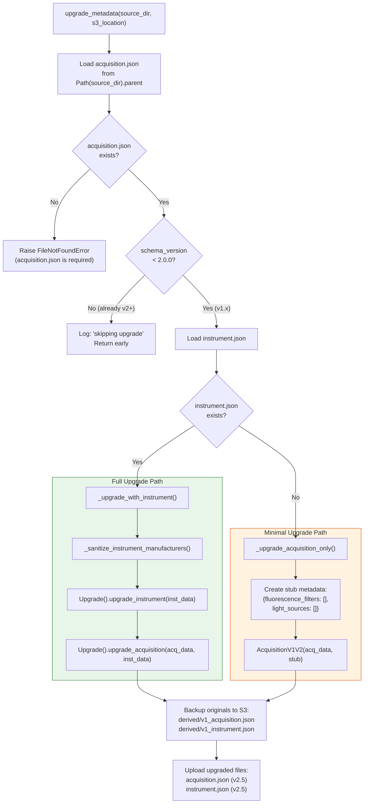
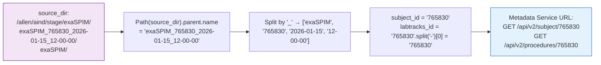
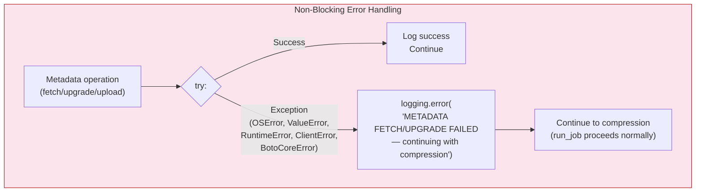
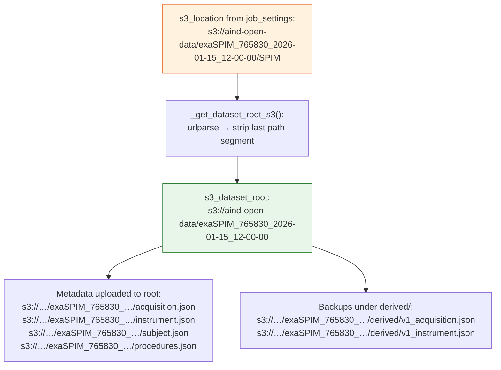
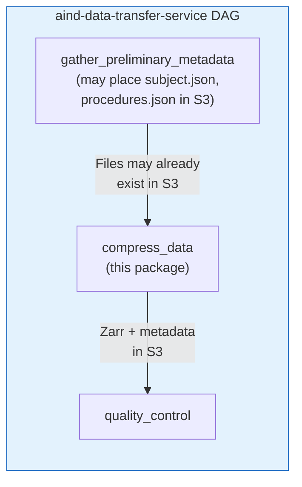

# Metadata Upgrade & Service Calls

## Overview

**Worker 0** exclusively handles metadata operations before proceeding to compression. This includes:

1. **Fetching** `subject.json` and `procedures.json` from `aind-metadata-service`
2. **Upgrading** `acquisition.json` and `instrument.json` from schema v1 → v2.5+
3. **Backing up** originals to S3 under `derived/`
4. **Uploading** upgraded files to the S3 dataset root

All metadata operations are **non-blocking** — failures are logged but do not abort compression.

---

## Sequence Diagram: Complete Metadata Flow

---

## `_sanitize_instrument_manufacturers()` — Pre-Processing

Before the upgrader runs, instrument data is sanitized to prevent crashes:

---

## Upgrade Decision Flow

---

## Subject ID Derivation

The metadata service requires a subject ID (LabTracks number). This is parsed from the dataset folder name:

---

## Error Handling Strategy

All metadata operations use a **fail-soft** pattern — errors are logged but never abort compression:

**Rationale:** The primary value of this pipeline is the ~120 TB compression job. Metadata can always be manually corrected later — but re-running a multi-hour compression job due to a metadata service timeout would waste significant compute resources.

---

## S3 Path Construction

The pipeline receives `s3_location` with a **modality subfolder** (e.g., `s3://bucket/dataset/SPIM`). Metadata belongs at the **dataset root** (one level up):

---

## Integration with Airflow Pipeline

The `_get_additional_metadata()` function checks whether files were already placed by the upstream `gather_preliminary_metadata` step using `_s3_object_exists()` — this avoids redundant metadata service calls and prevents overwriting correct data.

---

## Key Code References

| Component | File | Line |
|-----------|------|------|
| `_get_additional_metadata()` dispatch | `imaris_job.py` | L565 |
| `_upgrade_metadata()` dispatch | `imaris_job.py` | L600 |
| `_get_dataset_root_s3()` | `imaris_job.py` | L530 |
| `get_additional_metadata()` | `upgrade_metadata.py` | L509 |
| `upgrade_metadata()` | `upgrade_metadata.py` | L617 |
| `_sanitize_instrument_manufacturers()` | `upgrade_metadata.py` | L152 |
| `_derive_subject_id()` | `upgrade_metadata.py` | (internal) |
| `_needs_upgrade()` | `upgrade_metadata.py` | L60 |
| `_backup_original_to_s3()` | `upgrade_metadata.py` | L115 |
| `_upload_upgraded_to_s3()` | `upgrade_metadata.py` | L122 |
| `_s3_object_exists()` | `upgrade_metadata.py` | L96 |
| Error handling pattern | `imaris_job.py` | L580, L625 |
